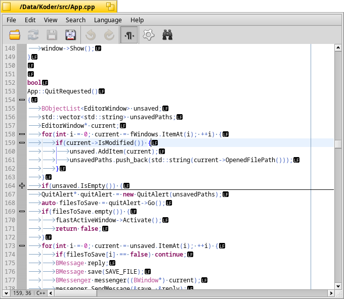

# **** Koder

Koder is a code editor built using Scintilla editing component.

## Dependencies

* Scintilla >=4.1.3
* yaml-cpp
* Scintilla [lexers](https://github.com/KapiX/scintilla-haiku-lexers) for Haiku specific file types

## Building

Koder uses makefile_engine. Invoke make in root directory.

## Installation

Copy all files from **data** directory to **Koder** directory in any non-packaged/data folder.

## History

0.5.3 - *27-06-2020*

* Fix crash on nested brackets in .editorconfig file.
* Update translations.

0.5.2 - *08-01-2020*

* Fix crash when opening Preferences.
* Fix garbage button text in file modified warning.

0.5.1 - *11-05-2019*

* Fix crash when external lexer is not found.
* Enable folding for Python.
* Fix crash when invoking incremental search twice.
* Fix read-only detection for volumes mounted as read-only.
* Highlight syntax for the entire file on language change.

0.5.0 - *01-04-2019*

* Make preferences update automatically.
* Add Open Terminal shortcut.
* Update line number margin on preferences change.
* Add support for loading external lexers.
* Add support for Jamfile, HaikuPorts recipe, YAB, RDef and Markdown.
* Remove read-only warning when opening a file.
* Fix automatic color updates for status bar.
* Highlight system constants in C++ mode.
* Change fold markers and highlight active folding block.
* Fix save and reload toolbar buttons state after external modification and file removal.
* Add bookmarks support.
* Add settings for margin visibility.
* Hide fold margin if folding is not enabled.
* Fixed caret position resetting when corresponding file was opened.
* Add option to automatically insert new line at the end on save.
* Add option to change toolbar icon size.
* Backup files before saving.
* Fix window resizing after changing toolbar visibility.
* Fix fold margin not appearing on language change.
* Fix observing wrong file after Save as operation.
* Fix opening non-existent files.
* Make sure caret is in top quarter of the view when opening a file.
* Add two new themes by Mikael Konradsson and dimmed theme by Humdinger.

0.4.1 - *23-11-2018*

* Fix crash in incremental search.
* Fix saving of Spaces per tab setting.

0.4.0 - *07-10-2018*

* Find/Replace window can be closed with Esc now.
* Fix for saving preferences.
* Save Find window settings.
* Limited .editorconfig support.
* Stack all windows besides those from Tracker.
* Add status bar.
* Add dark theme by Mikael Konradsson.
* Add support for HTML, CSS, JavaScript, PHP and OCaml.
* Change styling system to make creating new themes easier.
* Add quick search shortcuts.
* Implement incremental search.
* Fix horizontal scroll bar range.
* Add setting for line highlighting mode.
* Add option to always open files in new windows.
* Add option to change font.

0.3.0 - *20-03-2018*

* New icon.
* Add right-click menu.
* Disable menu items according to editor state.
* Fix multiple language entries in Language menu.
* Show alert if styles not found.
* Change shortcut for Go to line.
* Add View->Wrap lines.
* Add File->Reload.
* Add tooltips to toolbar buttons.
* Add option to attach windows to existing ones.
* Cascade windows if necessary.
* Open files in the same window only if it is new window and has not been modified.
* Add option to highlight trailing whitespace.
* Add option to trim trailing whitespace.
* Add option to trim trailing whitespace automatically on save.
* Use multiline controls in Find window.
* Add support for regex in Find/Replace.
* Fix keyboard navigation in Find/Replace.
* Rearrange Find/Replace window interface.
* Add "Open corresponding file" option.
* Fix opening files from command line.

0.2.0 - *15-04-2017*

* Add icon.
* Add translations.
* Adjust whitespace size.
* Fix crash when changing git branches with a file open.
* Fix horizontal scrollbar on long lines.
* Recolor the document on language change.
* Handle drag and drop message.
* Add jumping to specific position in file from command line. Handle parameters from /bin/open.
* Add comment line/block feature.
* Add indent guides highlighting.
* Add editor style menu to preferences.
* Add toolbar.
* Put selection in Find window automatically.
* Add AWK, Perl, Ruby and Rust support.

0.1.0 - *01-01-2017*

* Initial release.
